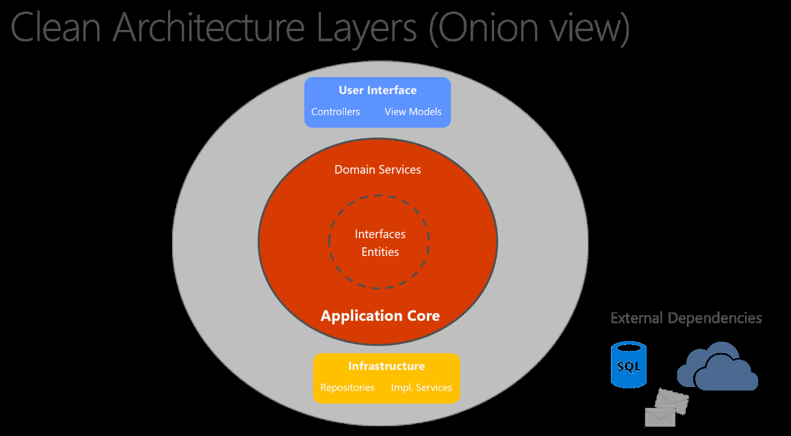
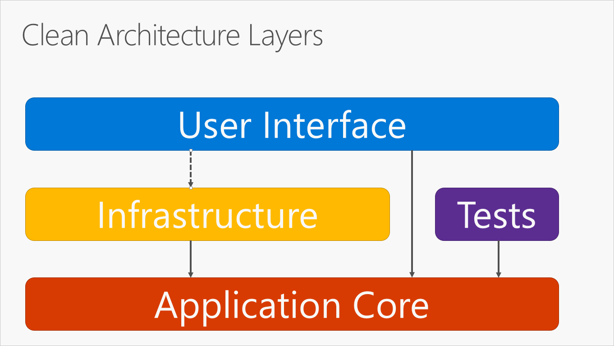
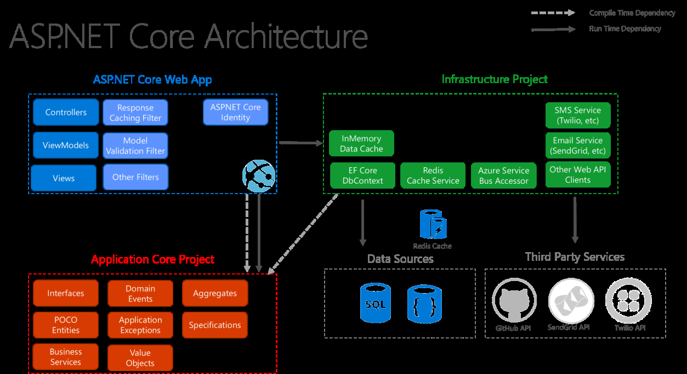

# Clean Architecture
  
[Back to Microsoft_Samples Home](../readme.md)

#### Clean Architecture Layers

 How to structure the project to make it easy to scale, maintain and test.

  
* [**GitHub sample Proj - eShopOnWeb/src/**](https://github.com/dotnet-architecture/eShopOnWeb/tree/master/src) 

* [Clean Architecture (Small HTML version of PDF)](https://docs.microsoft.com/en-us/dotnet/standard/modern-web-apps-azure-architecture/common-web-application-architectures#clean-architecture)

In this diagram, dependencies flow toward the innermost circle. The Application Core takes its name from its position at the core of this diagram. It has no dependencies on other application layers. The application’s entities and interfaces are at the very center. Just outside, but still in the Application Core, are domain services, which typically implement interfaces defined in the inner circle. Outside of the Application Core, both the UI and the Infrastructure layers depend on the Application Core, but not on one another (necessarily).

Note that the solid arrows represent compile-time dependencies, while the dashed arrow represents a runtime-only dependency. With the clean architecture, the UI layer works with interfaces defined in the Application Core at compile time, and ideally shouldn’t know about the implementation types defined in the Infrastructure layer. At run time, however, these implementation types are required for the app to execute, so they need to be present and wired up to the Application Core interfaces via dependency injection.

Because the Application Core doesn’t depend on Infrastructure, it’s very easy to write automated unit tests for this layer

#### Reference
 
* [Official Microsoft Guidance](https://www.microsoft.com/net/learn/architecture)

* [Architecture Example Project - eShopOnWeb](https://github.com/dotnet-architecture/eShopOnWeb)
 
 * [Common web application architectures](https://docs.microsoft.com/en-gb/dotnet/standard/modern-web-apps-azure-architecture/common-web-application-architectures)